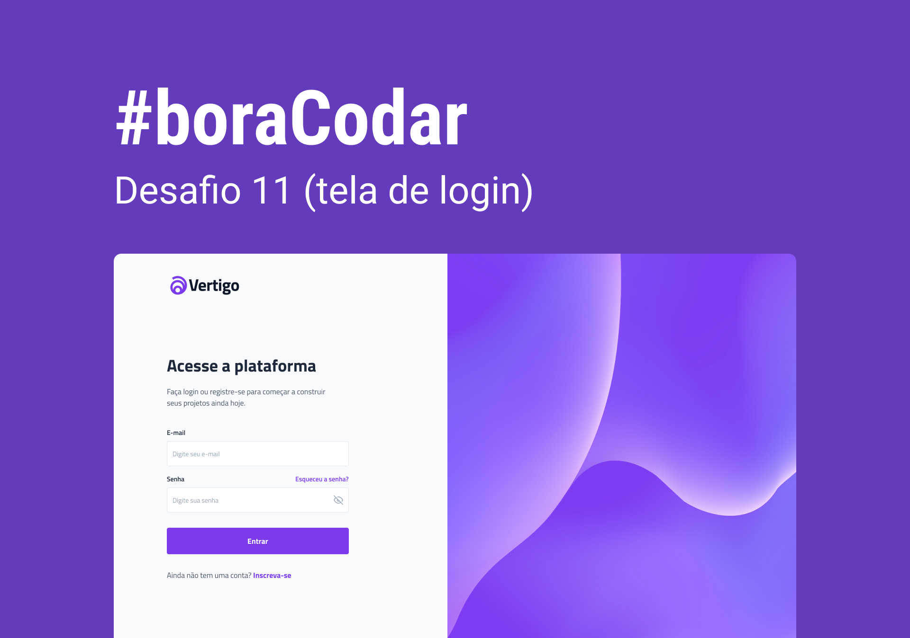

<h1 align="center">BoraCodar - Desafio 11 - Página de Login</h1>

  
  
  
  

  <a href="#-tecnologias">Tecnologias</a>&nbsp;&nbsp;&nbsp;|&nbsp;&nbsp;&nbsp;
  <a href="#-projeto">Projeto</a>&nbsp;&nbsp;&nbsp;|&nbsp;&nbsp;&nbsp;
  <a href="#-layout">Layout</a>&nbsp;&nbsp;&nbsp;

 

  

<h4 align="center">
  
  [Ver projeto](https://gabrielcenteiofreitas.github.io/estudos-rocketseat-boracodar11-pagina_de_login/)
</h4>

 

## 🚀 Tecnologias

Esse projeto foi desenvolvido com as seguintes tecnologias:

- Tailwind CSS
- HTML
- Javascript
- Figma

## 💻 Projeto

Projeto de uma Página de Login desenvolvido a partir do Desafio 11 do evento "BoraCodar" da Rocketseat com o objetivo de treinar e aprimorar habilidades.

Caso queira ver todos os desafios do evento clique [aqui](https://github.com/GabrielCenteioFreitas/estudos-rocketseat-boracodar).

## 🔖 Layout

Você pode visualizar o layout do projeto através [DESSE LINK](https://www.figma.com/community/file/1217810469465160264).
